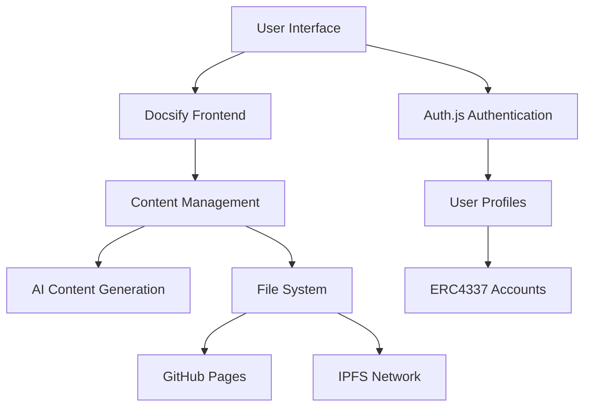

# Doris Protocol

> A decentralized content creation and publishing platform that empowers creators to escape big platform hegemony.

## What is Doris Protocol?

Doris Protocol is not just a blog tool - it's a revolutionary platform that combines the simplicity of traditional blogging with the power of Web3 technologies and AI assistance. Built on the principles of decentralization, creator ownership, and economic sustainability.

## ✨ Key Features

### 🔐 **Decentralized Authentication**
- Login with GitHub, Google, or email via Auth.js
- No central authority controls your account
- Your identity, your control

### 🤖 **AI-Powered Content Creation**
- Interactive AI chat for content generation
- Smart suggestions and writing assistance
- Transform raw ideas into polished markdown

### 📝 **Seamless Publishing**
- Automatic deployment to GitHub Pages
- IPFS integration for decentralized storage
- One-click publishing workflow

### 🔍 **Smart Discovery**
- Built-in search functionality
- Content categorization and tagging
- Easy content organization

### 💎 **Token Economics** *(Coming in v0.2.0)*
- ERC4337 account integration
- Token-based interactions (like, comment)
- Creator revenue sharing

## 🚀 Quick Start

### For Users

1. **Fork the Template**
   ```bash
   # Clone the Doris Protocol template
   git clone https://github.com/your-org/doris-protocol-template.git my-blog
   cd my-blog
   ```

2. **Install Dependencies**
   ```bash
   # Using pnpm (recommended)
   pnpm install
   
   # Or using npm
   npm install
   ```

3. **Start Writing**
   ```bash
   # Start the development server
   pnpm run serve:docs
   
   # Open http://localhost:3000
   ```

4. **Create Your First Post**
   ```bash
   # Use AI assistance to create content
   pnpm run generate:post
   ```

### For Developers

1. **Clone the Repository**
   ```bash
   git clone https://github.com/your-org/doris-protocol.git
   cd doris-protocol
   ```

2. **Set Up Development Environment**
   ```bash
   pnpm install
   pnpm run dev
   ```

3. **Read the Documentation**
   - [Solution Design](/docs/Solution.md)
   - [Features Overview](/docs/FEATURES.md)
   - [Development Plan](/docs/PLAN.md)

## 🏗️ Architecture

Doris Protocol is built on a modular architecture:



### Core Components

- **Content Carrier**: Docsify-based static site generator
- **Content Generation**: AI-assisted writing with OpenAI integration
- **Publishing**: Dual deployment to GitHub Pages and IPFS
- **Authentication**: Auth.js with multiple provider support
- **Token Economics**: ERC4337 account abstraction for Web3 features

## 🎯 Use Cases

### Content Creators
- **Freedom**: Own your content and audience
- **Monetization**: Direct creator rewards through token economics
- **Discoverability**: Built-in search and recommendation systems

### Bloggers
- **Simplicity**: Write in markdown with AI assistance
- **Performance**: Fast, static site generation
- **Reliability**: Decentralized hosting prevents censorship

### Communities
- **Collaboration**: Multiple contributors to shared blogs
- **Governance**: Token-based community decisions
- **Sustainability**: Economic incentives for quality content

## 🛣️ Roadmap

### Version 0.1.0 (Current) - Core Platform
- ✅ Docsify integration
- ✅ Basic authentication
- ✅ AI content generation
- ✅ GitHub Pages deployment
- ✅ Content management

### Version 0.2.0 - Web3 Integration
- 🔄 IPFS publishing
- 🔄 Token-based interactions
- 🔄 Score algorithm
- 🔄 Content indexing
- 🔄 ERC4337 integration

### Version 0.3.0 - Advanced Features
- ⏳ Content recommendation
- ⏳ Analytics dashboard
- ⏳ Mobile app
- ⏳ Community features

## 🤝 Contributing

We welcome contributions from the community! Whether you're:

- 🐛 **Reporting bugs**
- 💡 **Suggesting features**
- 📖 **Improving documentation**
- 💻 **Contributing code**

Please read our [Contributing Guide](/contributing.md) to get started.

## 📜 License

Doris Protocol is open source and available under the [MIT License](LICENSE).

## 🌟 Why Doris Protocol?

> "In a world where big platforms control the narrative, Doris Protocol gives the power back to creators."

- **Own Your Content**: Your posts, your rules, your revenue
- **Censorship Resistant**: Decentralized hosting prevents takedowns
- **Creator First**: Economics designed to reward quality content
- **Future Proof**: Built on open standards and protocols

## 📞 Support

- 📚 **Documentation**: [docs.dorisprotocol.com](https://docs.dorisprotocol.com)
- 💬 **Community**: [Discord](https://discord.gg/dorisprotocol)
- 🐦 **Updates**: [Twitter](https://twitter.com/dorisprotocol)
- 🐛 **Issues**: [GitHub Issues](https://github.com/your-org/doris-protocol/issues)

---

**Ready to take control of your content?** [Get Started Today!](/quickstart.md) 