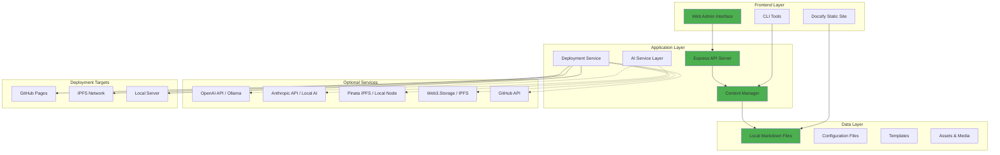

# Doris Protocol

> A **Local-First** decentralized content creation and publishing platform that empowers creators to escape big platform hegemony.

## What is Doris Protocol?

Doris Protocol is not just a blog tool - it's a revolutionary platform that combines the simplicity of traditional blogging with the power of Web3 technologies and AI assistance. Built on the principles of decentralization, creator ownership, and economic sustainability.

## 🎯 Local First Design Philosophy

**NEW:** Doris Protocol now prioritizes **local functionality** over cloud dependencies:

- ✅ **Basic Operations Work Offline**: Create, edit, preview content without internet
- ✅ **Optional Cloud Enhancement**: AI and IPFS services enhance but don't block functionality  
- ✅ **Self-Hosted Option**: Run your own AI (Ollama) and IPFS pin services
- ✅ **Progressive Enhancement**: Start simple, add services as needed
- ✅ **Data Ownership**: All content stored locally as standard Markdown files

## ✨ Key Features

### 🔐 **Decentralized Authentication** *(Coming in v0.3.0)*
- Login with GitHub, Google, or email via Auth.js
- No central authority controls your account
- Your identity, your control

### 🤖 **AI-Powered Content Creation**
- Interactive AI chat for content generation
- Smart suggestions and writing assistance
- Transform raw ideas into polished markdown
- **NEW:** Local AI support with Ollama (privacy-first)

### 📝 **Seamless Publishing**
- Automatic deployment to GitHub Pages
- IPFS integration for decentralized storage
- **NEW:** Local IPFS node support
- One-click publishing workflow

### 🔍 **Smart Discovery**
- Built-in search functionality
- Content categorization and tagging
- Easy content organization

### 💎 **Token Economics** *(Coming in v0.3.0)*
- ERC4337 account integration
- Token-based interactions (like, comment)
- Creator revenue sharing

## 🏗 System Architecture



## ⚡ Quick Start (Zero Dependencies)

```bash
# 1. Clone and setup
git clone <repository-url> my-blog
cd my-blog
pnpm install

# 2. Create content (works offline)
pnpm run generate:post

# 3. Preview locally
pnpm run serve:docs

# 4. Optional: Add AI enhancement
cp .env.example .env
# Edit .env with your API keys or local services
```

## 🛠 Core Features

### ✍️ Content Creation
- **Template System**: 6 built-in post templates  
- **Markdown Editor**: Browser-based editing with live preview
- **File Management**: Organize posts by year/month automatically
- **No Lock-in**: Standard markdown files, portable anywhere

### 🤖 AI Enhancement (Optional)
- **Cloud AI**: OpenAI GPT-4, Anthropic Claude
- **Local AI**: Ollama integration for privacy-first AI
- **Flexible**: Works without AI, enhanced with AI

### 🚀 Publishing Options
- **Static Site**: Docsify-powered documentation site
- **GitHub Pages**: Automated deployment via GitHub Actions
- **IPFS**: Decentralized publishing (Pinata, Web3.Storage, or local node)
- **Local Server**: Self-hosted with Express.js

## 📦 Installation & Setup

### Prerequisites
- **Node.js** v20+ 
- **pnpm** v8+
- **Git**

### Installation
```bash
pnpm install
```

### Local-Only Mode (No External Dependencies)
```bash
# Create content
pnpm run generate:post

# Preview site  
pnpm run serve:docs

# Web interface
pnpm run dev
```

### Enhanced Mode (With Cloud Services)
```bash
# Setup environment
cp .env.example .env
# Configure API keys in .env

# AI-enhanced content creation
pnpm run enhance:ai

# Deploy to IPFS
pnpm run deploy:ipfs
```

## 🏠 Self-Hosted Services

### Local AI with Ollama
```bash
# Install Ollama
curl -fsSL https://ollama.ai/install.sh | sh

# Run local model
ollama run llama2

# Configure in .env
LOCAL_AI_ENABLED=true
OLLAMA_BASE_URL=http://localhost:11434
OLLAMA_MODEL=llama2
```

### Local IPFS Node
```bash
# Install IPFS
curl -sSL https://dist.ipfs.io/go-ipfs/v0.18.1/go-ipfs_v0.18.1_linux-amd64.tar.gz | tar -xz
sudo mv go-ipfs/ipfs /usr/local/bin/

# Initialize and start
ipfs init
ipfs daemon

# Configure in .env  
LOCAL_IPFS_ENABLED=true
IPFS_API_URL=http://localhost:5001
```

## 📚 Usage

### Command Line Interface
```bash
# Content management
pnpm run generate:post     # Create new post
pnpm run enhance:ai        # AI content enhancement  
pnpm run update:sidebar    # Refresh navigation

# Publishing  
pnpm run deploy:ipfs       # Deploy to IPFS
pnpm run serve:docs        # Local preview
```

### Web Interface
```bash
# Start web server
pnpm run dev

# Access admin panel
open http://localhost:3000/admin.html
```

## 🔧 Configuration

### Environment Variables (.env)
```bash
# AI Services (Optional)
OPENAI_API_KEY=sk-your-key              # Cloud AI
ANTHROPIC_API_KEY=sk-ant-your-key       # Cloud AI
LOCAL_AI_ENABLED=true                   # Local AI (Ollama)
OLLAMA_BASE_URL=http://localhost:11434  # Ollama endpoint

# IPFS Services (Optional)  
PINATA_API_KEY=your-key                 # Cloud IPFS
WEB3_STORAGE_TOKEN=your-token           # Cloud IPFS
LOCAL_IPFS_ENABLED=true                 # Local IPFS
IPFS_API_URL=http://localhost:5001      # Local IPFS endpoint
```

## 📁 Project Structure

```
doris-protocol/
├── docs/                    # Content & site files
│   ├── admin.html          # Web management interface
│   ├── posts/              # Blog posts (by year/month)
│   ├── _sidebar.md         # Auto-generated navigation
│   └── index.html          # Docsify configuration
├── src/                     # Application source
│   ├── server.js           # Express API server
│   ├── services/           # Service integrations
│   └── local/              # Local service implementations
├── scripts/                 # CLI automation
│   ├── generate-post.js    # Content creation
│   ├── ai-enhance.js       # AI enhancement
│   ├── deploy-ipfs.js      # IPFS deployment
│   └── update-sidebar.js   # Navigation update
├── config/                  # Configuration management
├── templates/               # Content templates
├── local-services/          # Self-hosted service configs
│   ├── ollama/             # Local AI setup
│   └── ipfs/               # Local IPFS setup
└── .env.example            # Environment template
```

## 🚀 Quick Start

### For Users

1. **Fork the Template**
   ```bash
   # Clone the Doris Protocol template
   git clone https://github.com/your-org/doris-protocol-template.git my-blog
   cd my-blog
   ```

2. **Install Dependencies**
   ```bash
   # Using pnpm (recommended)
   pnpm install
   
   # Or using npm
   npm install
   ```

3. **Start Writing**
   ```bash
   # Start the development server
   pnpm run serve:docs
   
   # Open http://localhost:3000
   ```

4. **Create Your First Post**
   ```bash
   # Use AI assistance to create content
   pnpm run generate:post
   ```

### For Developers

1. **Clone the Repository**
   ```bash
   git clone https://github.com/your-org/doris-protocol.git
   cd doris-protocol
   ```

2. **Set Up Development Environment**
   ```bash
   pnpm install
   pnpm run dev
   ```

3. **Read the Documentation**
   - [Solution Design](/docs/Solution.md)
   - [Features Overview](/docs/FEATURES.md)
   - [Development Plan](/docs/PLAN.md)

## 🎯 Use Cases

### Content Creators
- **Freedom**: Own your content and audience
- **Monetization**: Direct creator rewards through token economics
- **Discoverability**: Built-in search and recommendation systems

### Bloggers
- **Simplicity**: Write in markdown with AI assistance
- **Performance**: Fast, static site generation
- **Reliability**: Decentralized hosting prevents censorship

### Communities
- **Collaboration**: Multiple contributors to shared blogs
- **Governance**: Token-based community decisions
- **Sustainability**: Economic incentives for quality content

## 🛣️ Roadmap

### Version 0.2.0 (Current) - Local First Core ✅
- ✅ Local content creation and management
- ✅ Web interface for content management  
- ✅ Optional cloud service integration
- ✅ Local AI service (Ollama) integration
- ✅ Local IPFS node integration
- ✅ Offline-first capabilities

### Version 0.3.0 - Advanced Local Features
- [ ] Full offline mode with service workers
- [ ] Local search and indexing
- [ ] Peer-to-peer content sharing
- [ ] Advanced local AI workflows
- [ ] Performance optimizations
- [ ] Web3 Integration (ERC4337, token economics)

### Version 0.4.0 - Community Features
- [ ] Content recommendation
- [ ] Analytics dashboard
- [ ] Mobile app
- [ ] Advanced community features

## 🤝 Contributing

We welcome contributions from the community! Whether you're:

- 🐛 **Reporting bugs**
- 💡 **Suggesting features**
- 📖 **Improving documentation**
- 💻 **Contributing code**

Please read our [Contributing Guide](CONTRIBUTING.md) to get started.

## 🌟 Why Doris Protocol?

> "In a world where big platforms control the narrative, Doris Protocol gives the power back to creators."

- **Own Your Content**: Your posts, your rules, your revenue
- **Censorship Resistant**: Decentralized hosting prevents takedowns
- **Creator First**: Economics designed to reward quality content
- **Future Proof**: Built on open standards and protocols
- **Privacy First**: Local-first design protects your data

## 📞 Support

- 📚 **Documentation**: [docs.dorisprotocol.com](https://docs.dorisprotocol.com)
- 💬 **Community**: [Discord](https://discord.gg/dorisprotocol)
- 🐦 **Updates**: [Twitter](https://twitter.com/dorisprotocol)
- 🐛 **Issues**: [GitHub Issues](https://github.com/your-org/doris-protocol/issues)

## 📜 License

Doris Protocol is open source and available under the [MIT License](LICENSE).

---

**Ready to take control of your content?** [Get Started Today!](#-quick-start) 

**Built with ❤️ for content creators who value ownership and privacy** 